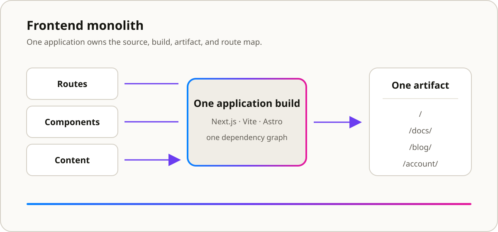
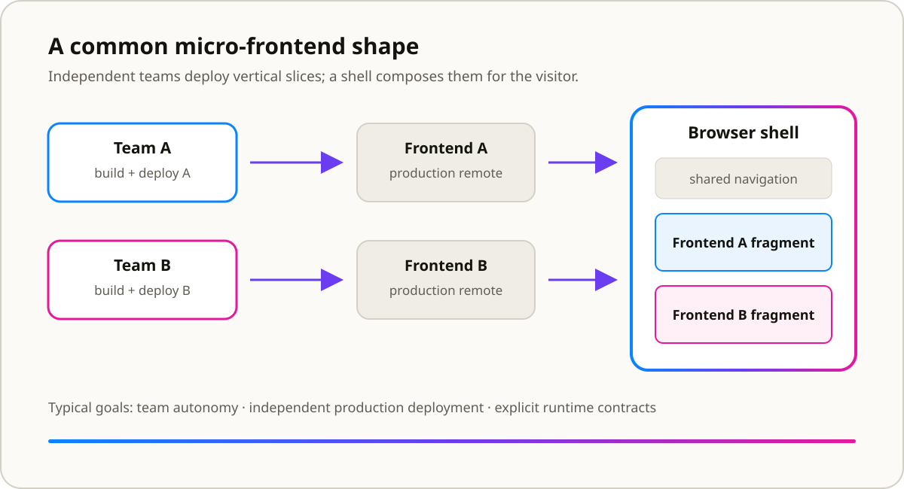
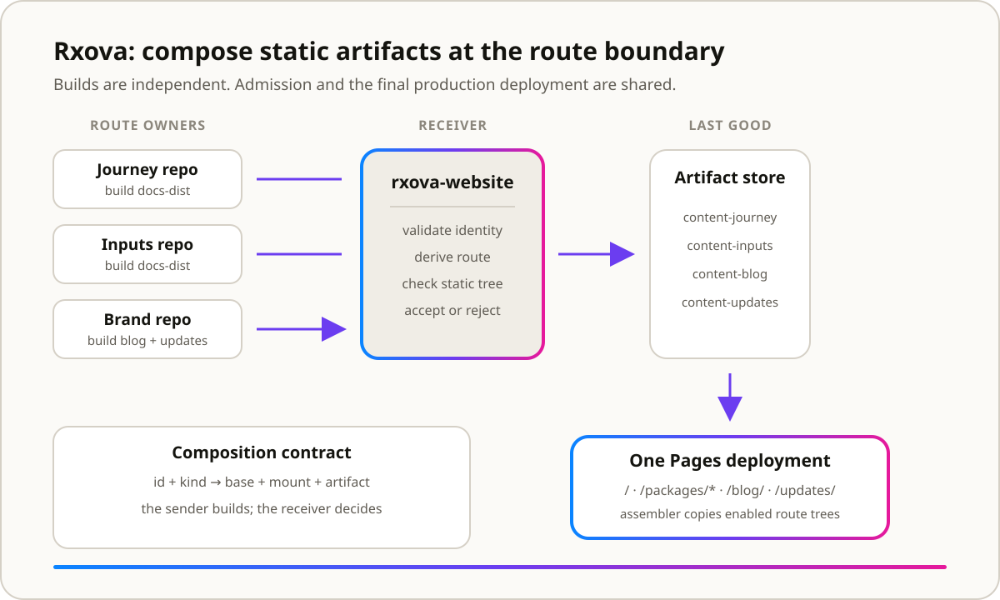

Most websites start with an empty app and grow inward.

You create a Next.js project. Vite. Vue. Craco. Astro. All of them follow the same
principle: you add pages, a `content/` directory, Vitest, a deploy workflow, and
voilà: a website. The source code, content and thing that eventually reaches
production all live in the same place.

The app is the website.

That model works extremely well. Rxova's website had a different problem: present
several independently built applications under one domain without forcing them into
one build graph or browser runtime. The composition unit was the route.

## First, what is a frontend monolith?

“Monolith” has become one of those words people say as though the architecture has
already lost an argument. It has not.

A frontend monolith is one deployable frontend unit. One application owns the route
map, page composition, content integration and production artifact. Its code can be
modular and split into packages; the boundary that matters is the build. Everything
enters one graph and leaves as one release.

Next.js, Vite and Astro are not monolithic architectures by themselves. They are
tools. They produce a frontend monolith when one project built with them owns the
whole website. They can also participate in other architectures.



_In the usual model, one build owns both the source and the final route map._

## Then, what is a micro-frontend?

A micro-frontend moves decomposition beyond internal modules. A vertical slice of
the user experience has its own codebase, delivery pipeline and owner. The goal is
not merely smaller bundles. It is autonomy: one team should be able to change and
release its part of the product without synchronising the whole frontend.

Runtime composition—Module Federation, `single-spa`, web components—is the familiar
shape, but a micro-frontend can own an entire page. What matters is a meaningful
product boundary that can travel independently to production.



_One common form, not the only one: independently deployed slices composed by a
browser shell._

The influential
[micro-frontends description](https://martinfowler.com/articles/micro-frontends.html)
centres autonomous teams, vertical ownership and independent production deployment.
Those are organisational properties expressed through technology, not a synonym for
“more than one frontend repository.”

## Why Rxova's Website Is Neither a Monolith nor a Micro-Frontend Architecture

Rxova's website is made from several complete static applications. The landing owns
`/`. Journey owns `/packages/journey/`. The blog owns `/blog/`. Updates owns
`/updates/`.

Each route owner has its own source, dependencies and build. Documentation lives
beside the code it explains, and no application can see every page at build time.
Each produces a finished static tree for its path.

Those outputs become one production tree, but no single frontend build produces it.
That rules out a frontend monolith.

Micro-frontends is closer: the codebases are independent, can use different
frameworks, share no build, and still form one user-facing product. But the label
imports expectations that make the actual design harder to see.

Every document belongs to exactly one route owner, so no runtime shell loads one
application's component beside another. Crossing a boundary unloads one document and
loads the next. There is no shared React instance, remote module, cross-application
state or in-page integration contract.

Most importantly, route owners build independently but do not deploy independently
to production. Rxova's website validates their artifacts, assembles the enabled set
and publishes one combined tree.

Micro-frontends is useful ancestry. It is not the most useful name.

The longer implementation story—flags, failed central builds, artifact persistence
and the eventual pipeline—lives in
[How Rxova's Website Architecture Evolved](../how-rxovas-website-architecture-evolved/).

## What About the Other Alternatives?

[Next.js Multi-Zones](https://nextjs.org/docs/app/guides/multi-zones) is the closest
established term. Different applications own different paths on one domain, and
crossing a zone causes a hard navigation. But zones remain independently deployed;
a proxy or rewrite sends each request to the correct origin. Rxova's website copies
persisted static outputs into one deployment instead.

“Docs portal” describes the product, not the general architecture. “Composed static
site” is accurate but does not identify where composition happens.

For this shape, **route-based composition** is the precise name: one application
owns each route subtree, and composition happens at that boundary.

## How Route-Based Composition Works

Each route owner builds for its final public base and publishes an artifact. A
receiver validates and persists the last accepted version, then assembles the
enabled trees or feeds their locations into an origin router.



_Rxova's implementation assembles static files. The same route contract could drive
a proxy instead._

The path is part of the application contract. A static tree built for `/` and moved
under `/packages/journey/` can return a healthy `index.html` while every stylesheet
and script returns 404. The public base, mount and artifact identity therefore need
to come from one source of truth.

The receiver is authoritative: a route owner may offer an artifact but cannot mount
itself. Bad input leaves production untouched; a missing enabled route stops the
deployment rather than publishing a hole.

Shared design is a separate contract. Route owners consume `@rxova/brand`, a
versioned package of tokens and shared chrome. That introduces a genuine
micro-frontend problem—version skew—because a canonical package cannot force
consumers to upgrade.

## When This Boundary Works

Route-based composition fits separately owned or versioned products with different
frameworks and cadences, route-level isolation, and no shared runtime state.

It is a poor fit for a flow that constantly crosses boundaries, shares client state
or needs several teams to render into one document. It is unnecessary when one
application can own everything. A hard navigation should be an acceptable property
of the boundary, not an accident users pay for repeatedly.

Rxova's implementation is cheap because npm and GitHub already provide distribution,
dispatch, storage and hosting. It is not vendor-neutral; its underlying contract is
more portable:

```text
source identity + route kind
  -> derived public base
  -> independently built artifact
  -> receiver validation
  -> persisted last-good version
  -> route manifest
  -> assembly or origin routing
```

## Conclusion

The frontend world is excellent at both ends of this spectrum.

Frameworks build one application extremely well. Micro-frontend tooling composes
independently deployed code in a runtime. Hosting platforms offer proprietary
multi-zone routing between applications.

There is less tooling for the middle: independently owned applications composed at
route boundaries without requiring one framework, runtime, monorepo or host.

We need portable route manifests, artifact contracts, last-good storage and routing
or assembly layers that scale across codebases and teams. The URL is already an open
interface; a hard navigation can be a feature when it buys real isolation.

A frontend monolith remains the right choice when the product has one boundary.
Runtime micro-frontends remain powerful when several owners must collaborate inside
one page. Route-based composition deserves equally good primitives for everything
between them.
